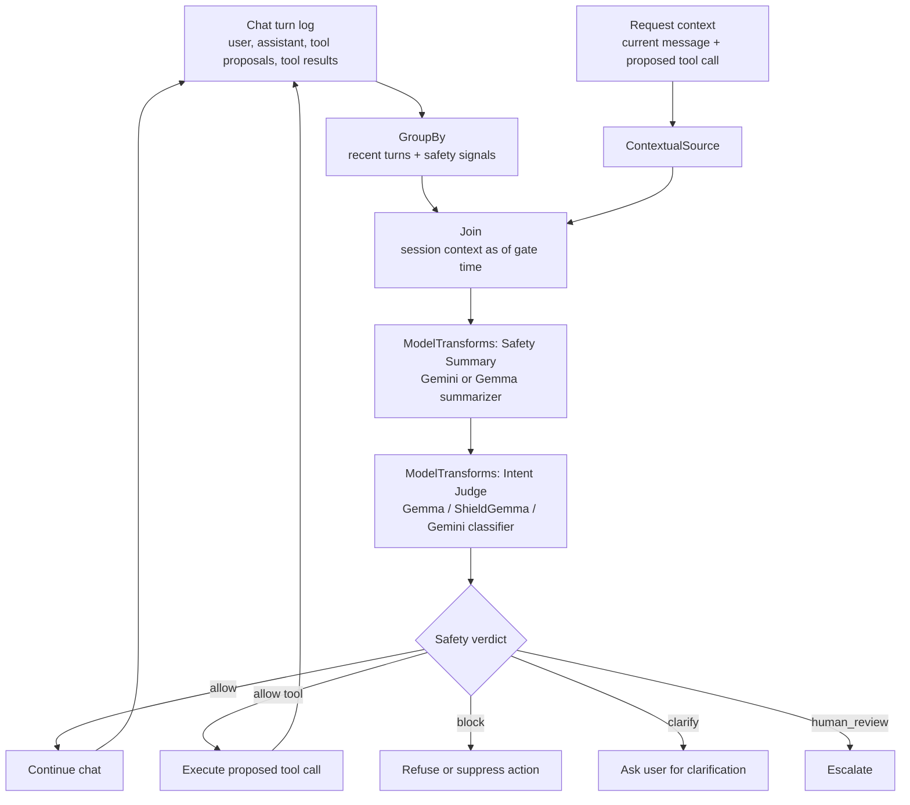

# Chat Guardrails v2

LLM chat applications increasingly read private context, call tools, and take
actions on behalf of users. Safety checks need the same context the assistant
used: recent conversation, durable memory, the current request, and any pending
tool call.

At each safety gate, the chat service asks a second model to review the user
request or proposed tool action using structured conversation context.

## Chronon approach

Chronon's API is a set of pluggable building blocks: `Source`, `GroupBy`,
`ContextualSource`, `Join`, `Model`, `ModelTransforms`, `InferenceSpec`, and
`DeploymentSpec`. Teams arrange these blocks into the architecture their
application needs, from low latency feature serving to offline evaluation and
model orchestration.

For chat guardrails, the same primitives assemble conversation context, run
summary and judge models, and record versioned safety decisions.

## Safety goal

For each safety gate, classify:

```text
chat history summary
+ current user ask
+ optional model-proposed tool call before execution
=> intent / risk / verdict
```

Return a small contract that application code can branch on:

```json
{
  "verdict": "allow | block | clarify | human_review",
  "intent": "benign | ambiguous | malicious",
  "risk_categories": ["prompt_injection", "data_exfiltration"],
  "confidence": 0.92,
  "policy_version": "llm_safety_policy_2026_05",
  "evidence_turn_ids": ["turn_083", "turn_084"]
}
```

## Threat model

This design is aimed at three common failure modes:

- **Multi-turn jailbreaks.** The harmful intent may be spread across several
  benign-looking turns, so the judge needs conversation memory.
- **Indirect prompt injection.** Retrieved content, tool output, or user-provided
  documents can contain instructions that conflict with the user's actual goal.
- **Unsafe tool use.** The user message may look acceptable while the proposed
  tool call would expose data, mutate state, or cross a policy boundary.

## Architecture



Run the guardrail at three points:

1. After each user message.
2. After the assistant proposes a tool call, before execution.
3. Optionally after tool results return, before exposing them to the model.

## Why Chronon

Chronon gives the guardrail the same properties teams expect from production
feature pipelines: consistent context assembly, versioned model outputs, and
replayable logs.

- **Point-in-time context.** A `Join` assembles the exact conversation state that
  existed when the safety decision was made.
- **Online/offline consistency.** The same pipeline can serve online decisions
  and produce offline evaluation datasets for red-team tests and regression
  analysis.
- **Replayability.** Logged join/model outputs let teams answer: what was
  judged, by which model version, under which policy version, before which tool
  execution?
- **Composable model calls.** `ModelTransforms` can call a summarizer first and
  feed its output into a downstream judge.
- **Backend abstraction.** `InferenceSpec` routes inference to the model
  platform; `DeploymentSpec` describes serving resources and rollout strategy
  for custom models.

## Recommended pipeline

The chat app calls the final `ModelTransforms` endpoint. The request keys
include normal join keys plus request-time fields such as `current_message` and
`pending_tool_call_json`.

```text
chat app request
  -> ContextualSource(current_message, pending_tool_call_json, gate_type)
  -> JoinSource(session_context_join)
  -> ModelTransforms(summary_model)
  -> ModelTransforms(intent_judge_model)
  -> safety_verdict
```

`ContextualSource` is the bridge for the most recent user ask and proposed tool
call. The join output exposes those fields as contextual features, for example
`ext_contextual_current_message` and `ext_contextual_pending_tool_call_json`.

The summary model produces a compact safety memory:

```json
{
  "user_goal": "...",
  "recent_intent": "...",
  "prior_safety_events": [],
  "sensitive_entities": [],
  "tool_use_context": [],
  "open_risks": [],
  "source_turn_ids": []
}
```

The judge model reads that summary plus the current ask and, when present, the
pending tool call JSON.

Within a single `ModelTransforms` block, models read the same source row and run
independently. Chain separate `ModelTransforms` blocks when one model's output
becomes another model's input.

In the chained path, Chronon passes the upstream model-transform output into the
downstream source row. The judge can reference both the contextual join fields
and the summary model's output in its `input_mapping`.

## Minimal Chronon shape

Only the relevant pieces are shown here.

```python
from ai.chronon.types import (
    Model, ModelTransforms, InferenceSpec, ModelBackend,
    DeploymentSpec, ContextualSource, ExternalPart, Join, JoinSource, DataType,
)

contextual_request = ContextualSource(
    fields=[
        ("request_id", DataType.STRING),
        ("current_message", DataType.STRING),
        ("pending_tool_call_json", DataType.STRING),
        ("gate_type", DataType.STRING),
    ]
)

session_context_join = Join(
    ...,
    online_external_parts=[ExternalPart(contextual_request)],
)

summary_model = Model(
    version="1.0",
    inference_spec=InferenceSpec(
        model_backend=ModelBackend.VERTEXAI,
        model_backend_params={
            "model_name": "gemini-2.5-flash",
            "prompt_version": "safety_summary_v1",
        },
    ),
    input_mapping={
        "messages": "recent_turns_json",
        "previous_summary": "prior_safety_summary_json",
        "current_user_ask": "ext_contextual_current_message",
        "pending_tool_call": "ext_contextual_pending_tool_call_json",
    },
    value_fields=[
        ("safety_summary_json", DataType.STRING),
        ("summary_source_turn_ids", DataType.STRING),
    ],
)
```

```python
judge_model = Model(
    version="1.0",
    inference_spec=InferenceSpec(
        model_backend=ModelBackend.VERTEXAI,
        model_backend_params={
            "model_name": "gemma-guardrail",
            "policy_version": "llm_safety_policy_2026_05",
        },
    ),
    input_mapping={
        "summary": "summary_model__safety_summary_json",
        "current_user_ask": "ext_contextual_current_message",
        "pending_tool_call": "ext_contextual_pending_tool_call_json",
    },
    value_fields=[
        ("verdict", DataType.STRING),
        ("intent", DataType.STRING),
        ("risk_categories", DataType.STRING),
        ("confidence", DataType.DOUBLE),
        ("policy_version", DataType.STRING),
        ("evidence_turn_ids", DataType.STRING),
    ],
)
```

```python
summary_context = ModelTransforms(
    sources=[JoinSource(session_context_join)],
    models=[summary_model],
    passthrough_fields=[
        "request_id",
        "session_id",
        "gate_type",
        "ext_contextual_current_message",
        "ext_contextual_pending_tool_call_json",
    ],
    version=1,
)

guardrail_verdict = ModelTransforms(
    sources=[summary_context],
    models=[judge_model],
    passthrough_fields=["request_id", "session_id", "gate_type"],
    version=1,
)
```

Exact model-output prefixes are assigned at compile time. In the judge mapping,
replace `summary_model__safety_summary_json` with the compiled output field for
the summary model. The summary block also passes through the contextual fields
that the judge reads directly.

For hosted models, most routing information belongs in `InferenceSpec`. For a
custom Gemma-based classifier hosted on Vertex AI or SageMaker, use
`DeploymentSpec` to describe the serving container, endpoint, resources, and
rollout behavior.

```python
Model(
    version="1.0",
    inference_spec=InferenceSpec(
        model_backend=ModelBackend.VERTEXAI,
        model_backend_params={"endpoint_name": "llm-safety-judge"},
    ),
    deployment_conf=DeploymentSpec(...),
    value_fields=[("verdict", DataType.STRING)],
)
```

## Design rules

- Preserve provenance. Keep `summary`, `current_user_ask`, `pending_tool_call`,
  and `tool_result` as separate fields; each has a different trust boundary.
- Judge tool calls before execution. A harmless-looking user request can become
  unsafe once paired with a concrete tool action.
- Keep outputs schema-first. Application code branches on `verdict`; explanatory
  text can live in a separate field.
- Version everything: prompt, policy, model, deployment, and summary schema.
- Log replay identifiers, versions, labels, and compact evidence fields. Omit
  raw secrets and unnecessary sensitive content.

## Operational checklist

- **Latency.** Run the cheapest reliable judge on every gate. Use the
  summary-first path when history is long or the tool action is high impact.
- **Failure handling.** Decide fail-open or fail-closed per gate before launch.
  Tool-call gates usually deserve stricter handling than normal user turns.
- **Shadowing.** Run new judge versions beside the current version before
  switching enforcement.
- **Sampling.** Log enough decisions to evaluate drift and replay incidents.
- **Caching.** Cache repeated summaries and identical judge inputs when the chat
  flow creates duplicate checks.

## Evaluation

Evaluate guardrail changes before enforcement. A useful review set includes:

- multi-turn jailbreak attempts,
- prompt injection through retrieved content or tool output,
- safe requests that mention sensitive topics,
- unsafe tool calls hidden behind benign phrasing,
- production false positives and false negatives from prior versions.

Use a stable taxonomy for `risk_categories`, ideally one that maps to existing
guardrail models such as ShieldGemma, Llama Guard, or another policy classifier
your team already evaluates.

## What the chat app does

Chronon produces the decision. The application enforces it:

```text
allow         -> continue
block         -> refuse or suppress the unsafe action
clarify       -> ask a narrow follow-up question
human_review  -> stop automation and escalate
```

This split keeps responsibilities clear. Chronon assembles context, invokes the
models, records versions, and writes replayable logs. The chat service handles
user experience, tool execution, and final policy enforcement.
