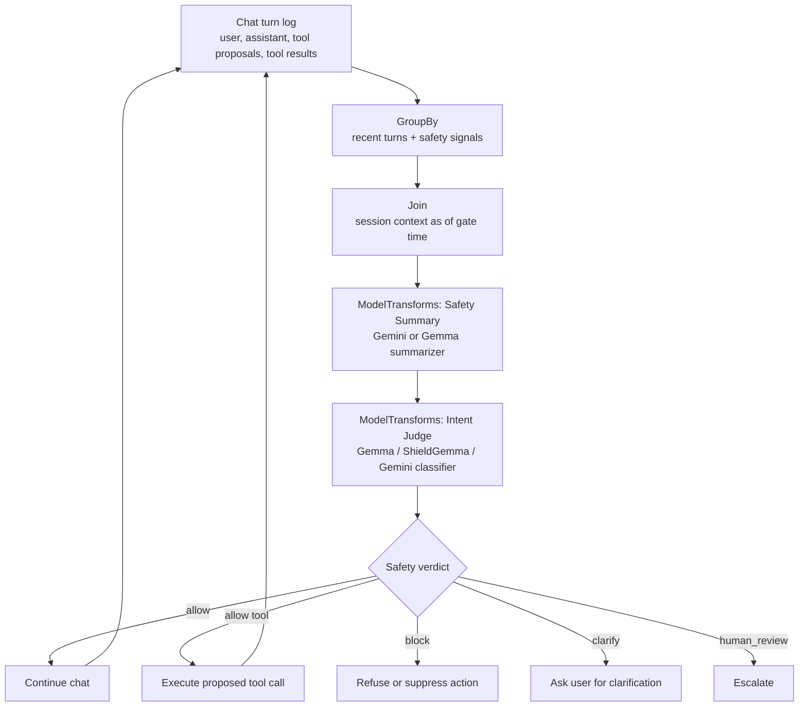

# Chat Guardrails v2

This guide describes a concise production pattern for making LLM chat
applications safer with Chronon's `Join`, `Model`, `ModelTransforms`,
`InferenceSpec`, and `DeploymentSpec` primitives.

The core idea is simple: before an LLM response is trusted, and especially
before a tool call is executed, classify the user's intent and the proposed
action using another model over structured conversation context.

## Safety goal

For each safety gate, classify:

```text
chat history summary
+ current user ask
+ optional model-proposed tool call before execution
=> intent / risk / verdict
```

The output should be structured, stable, and directly actionable:

```json
{
  "verdict": "allow | block | clarify | human_review",
  "intent": "benign | ambiguous | malicious",
  "risk_categories": ["prompt_injection", "data_exfiltration"],
  "confidence": 0.92,
  "policy_version": "llm_safety_policy_2026_05",
  "evidence_turn_ids": ["turn_083", "turn_084"]
}
```

## Architecture



Run the guardrail at three points:

1. After each user message.
2. After the assistant proposes a tool call, before execution.
3. Optionally after tool results return, before exposing them to the model.

## Why Chronon

Chronon is useful here because guardrails are not just prompts. They are
feature pipelines with auditability requirements.

- **Point-in-time context.** A `Join` assembles the exact conversation state that
  existed when the safety decision was made.
- **Online/offline consistency.** The same pipeline can serve online decisions
  and produce offline evaluation datasets for red-team tests and regression
  analysis.
- **Replayability.** Logged join/model outputs let teams answer: what was
  judged, by which model version, under which policy version, before which tool
  execution?
- **Composable model calls.** `ModelTransforms` can call a summarizer first and
  feed its output into a downstream judge.
- **Backend abstraction.** `InferenceSpec` routes inference to the model
  platform; `DeploymentSpec` describes serving resources and rollout strategy
  for custom models.

## Recommended pipeline

Use two chained `ModelTransforms`, not one large prompt.

```text
JoinSource(session_context_join)
  -> ModelTransforms(summary_model)
  -> ModelTransforms(intent_judge_model)
  -> safety_verdict
```

The summary model should produce a compact, structured safety memory:

```json
{
  "user_goal": "...",
  "recent_intent": "...",
  "prior_safety_events": [],
  "sensitive_entities": [],
  "tool_use_context": [],
  "open_risks": [],
  "source_turn_ids": []
}
```

The judge model should consume that summary plus the current ask and, when
present, the pending tool call JSON.

## Minimal Chronon shape

Only the relevant pieces are shown here.

```python
from ai.chronon.types import (
    Model, ModelTransforms, InferenceSpec, ModelBackend,
    DeploymentSpec, JoinSource, DataType,
)

summary_model = Model(
    version="1.0",
    inference_spec=InferenceSpec(
        model_backend=ModelBackend.VERTEXAI,
        model_backend_params={
            "model_name": "gemini-2.5-flash",
            "prompt_version": "safety_summary_v1",
        },
    ),
    input_mapping={
        "messages": "recent_turns_json",
        "previous_summary": "prior_safety_summary_json",
    },
    value_fields=[
        ("safety_summary_json", DataType.STRING),
        ("summary_source_turn_ids", DataType.STRING),
    ],
)
```

```python
judge_model = Model(
    version="1.0",
    inference_spec=InferenceSpec(
        model_backend=ModelBackend.VERTEXAI,
        model_backend_params={
            "model_name": "gemma-guardrail",
            "policy_version": "llm_safety_policy_2026_05",
        },
    ),
    input_mapping={
        "summary": "summary_model__safety_summary_json",
        "current_user_ask": "current_message",
        "pending_tool_call": "pending_tool_call_json",
    },
    value_fields=[
        ("verdict", DataType.STRING),
        ("intent", DataType.STRING),
        ("risk_categories", DataType.STRING),
        ("confidence", DataType.DOUBLE),
        ("policy_version", DataType.STRING),
        ("evidence_turn_ids", DataType.STRING),
    ],
)
```

```python
summary_context = ModelTransforms(
    sources=[JoinSource(session_context_join)],
    models=[summary_model],
    passthrough_fields=["session_id", "current_message", "pending_tool_call_json"],
    version=1,
)

guardrail_verdict = ModelTransforms(
    sources=[summary_context],
    models=[judge_model],
    passthrough_fields=["session_id"],
    version=1,
)
```

For hosted models, most routing information belongs in `InferenceSpec`. For a
custom Gemma-based classifier hosted on Vertex AI or SageMaker, use
`DeploymentSpec` to describe the serving container, endpoint, resources, and
rollout behavior.

```python
Model(
    version="1.0",
    inference_spec=InferenceSpec(
        model_backend=ModelBackend.VERTEXAI,
        model_backend_params={"endpoint_name": "llm-safety-judge"},
    ),
    deployment_conf=DeploymentSpec(...),
    value_fields=[("verdict", DataType.STRING)],
)
```

## Design rules

- Preserve provenance. Keep `summary`, `current_user_ask`, `pending_tool_call`,
  and `tool_result` as separate fields instead of flattening everything into one
  string.
- Judge tool calls before execution. A harmless-looking user request can become
  unsafe once paired with a concrete tool action.
- Keep outputs schema-first. Application code should branch on `verdict`, not
  parse free-form model text.
- Version everything: prompt, policy, model, deployment, and summary schema.
- Log enough to replay decisions, but avoid logging raw secrets or unnecessary
  sensitive content.

## What the chat app does

Chronon produces the decision. The application enforces it:

```text
allow         -> continue
block         -> refuse or suppress the unsafe action
clarify       -> ask a narrow follow-up question
human_review  -> stop automation and escalate
```

This separation is intentional. Chronon owns context assembly, model invocation,
versioned outputs, and replayable logs. The chat service owns user experience,
tool execution, and final policy enforcement.
